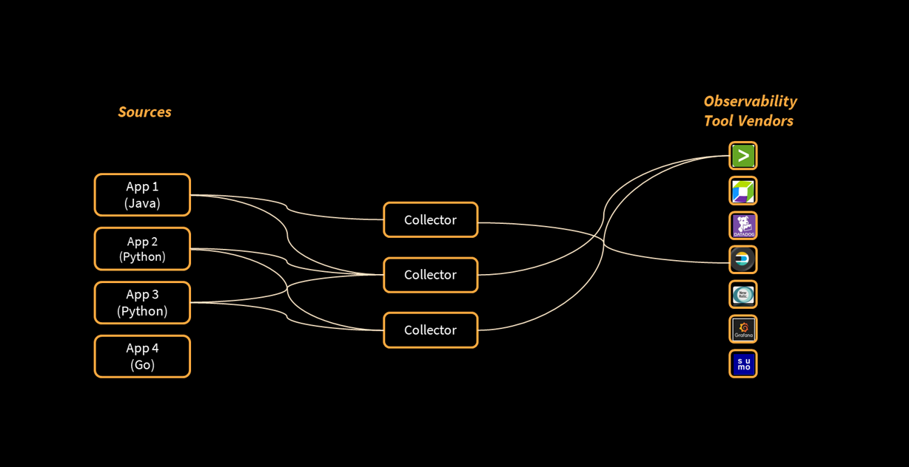
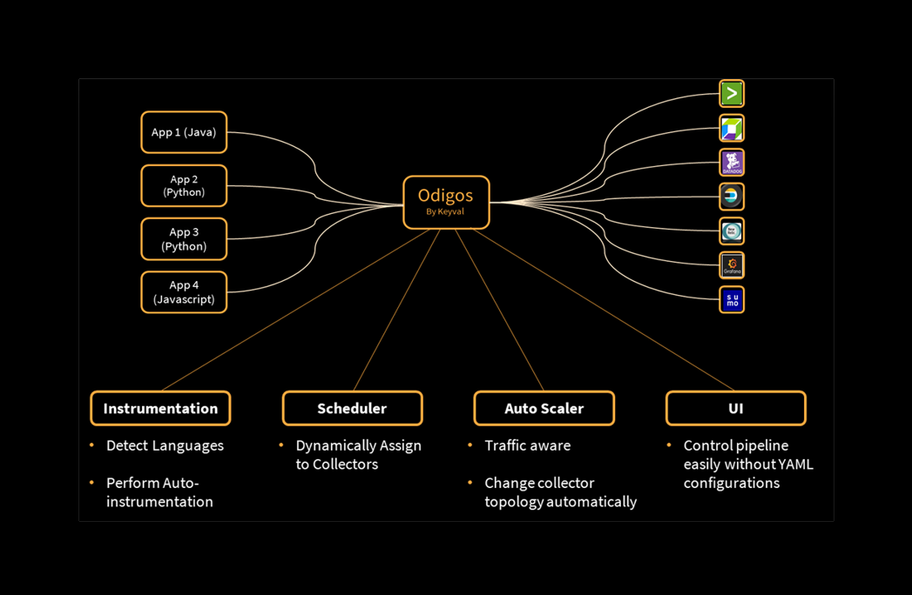

As organizations deploy and maintain modern applications and microservices, Observability technologies (eBPF & OpenTelemetry) are needed to expose their health & security. If you’re using these technologies for Tracing, Metrics or Logs in a production software system, you’re either sending telemetry data directly from you application or using a collector.

Configuring OpenTelemetry to send traces and metrics directly from your app to your desired destination has the benefit of not running any additional software (no ports to configure, no processes to manage). The downside is that your application must manage the entire workload of sending your data in a production environment (running resource-intensive services), as well as the **need to continuously configure and update your code** as you scale (or add new applications).

Offloading the job of sending data directly from the application can be a huge help. Deploying collectors allows you to process telemetry and send it out to any destination. The OpenTelemetry Collector, an open-source project backed by the CNCF, offers a vendor-agnostic implementation that uses pipelines to receive, process, and export trace data. It is a stand-alone service chaining together plugins to form an observability pipeline that buffers data, scrubs it, and sends to one or more open-source or commercial back-ends.

The OpenTelemetry Collector is configurable. When tasked with deploying Collectors in a production environment, Devops team will find two repositories containing dozens of modules, with many integration possibilities. The problem is that it’s hard to know what module will best fit your changing requirements. Without proper implementation and continuous configuration of your collectors, observability tools will be limited at best and many times ineffectual

There are solutions out there. Many of the large commercial observability tool vendors provide different open-source solutions that will ease implementation. Often, implementation will include vendor specific API’s that are not compatible with other tools, further complicating any efforts of working with more than one vendor.  
Actual implementation and integration are still a lengthy process that requires knowledge and experience to get done right. It’s enough to take a quick look at the “getting started” pages of the different observability vendors out there to see how complicated this integration still is.

Odigos, an open-source observability control plane just released in July ’22, provides auto-instrumentation as well as a collector management capabilities. The platform is actually comprised of four fundamental parts: an Instrumentor, Scheduler, Auto-scaler & the UI.

This is the way it works:

- First, Odigos **recognizes** the different programming languages used in each application
- Then it **auto-instruments** each application using different (open-source) tools for each programming language
- The **auto-scaler** deploys and configures the OpenTelemetry collectors
- The **scheduler** assigns applications discovered by the instrumentor to the collector’s pipeline create by the auto-scaler
- Finally, a **UI** provides a simple interface to manage the whole process

Odigos’s advantages include its easy installation and its ability to continuously adapt as well as scale to size. The auto-instrumentation will allow Odigos to recognize new application the minute it starts running on your system, and automatically deploy the appropriate collectors. **No changes to the code, no developer action needed and no Devops team required!** A new application will produce signals without any additional interventions needed.

## Summary

Integrating Observability Tools require companies to make several changes and configurations to their applications and infrastructure. Current solutions still demand tech teams to continuously deploy, configure and update collectors, as well as learn SDK’s, add auto-instrumentation, change application code – all requiring new and different developer skillsets.

With the latest advancements in observability technologies (eBPF & OpenTelemetry), companies can now build their observability pipeline with complete end-to-end open-source solution. Using open-source (Jaeger, Grafana, etc.) or commercial back-ends together with the open-source Odigos observability control plane, companies can get full end-to-end visibility. Ultimately, Odigos provides a simple installation that allows companies to get traces, metrics, and logs within minutes – and takes care of managing (configuring, deploying and scaling) your OpenTelemetry collectors.
